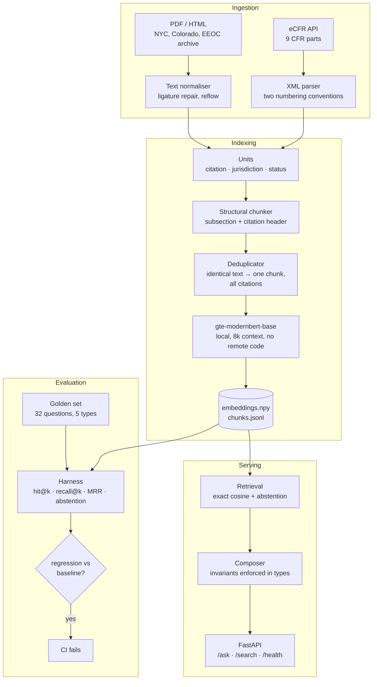

# hiring-law-rag

Citation-grounded retrieval over US employment-discrimination regulations and AI-hiring
rules, built to answer one question that most retrieval demos cannot: **how do you know
it works, and how would you notice if a change made it worse?**

The system reports what published regulations say, with citations. It does not give legal
advice, and it refuses to.

---

## The problem

New York City's Local Law 144 requires employers using an automated hiring tool to run an
annual bias audit that computes an **impact ratio**. The law never states what impact ratio
is acceptable.

That threshold is the **four-fifths rule** — a selection rate below 80% of the highest
group's rate is evidence of adverse impact — and it lives in
[29 CFR 1607.4(D)](https://www.ecfr.gov/current/title-29/part-1607), published in 1978.
The 2023 city law does not cite it.

So the question *"does my hiring tool pass NYC's bias audit?"* requires two documents
written forty-five years apart, sharing almost no vocabulary, with no citation between
them. A naive vector search retrieves the 2023 law, answers confidently, and silently omits
the number that determines the actual answer.

That failure — and three others found by measuring rather than guessing — is what this
project is built around.

---

## Architecture



---

## Run it

```bash
docker compose up --build
```

The image bakes in the model weights and builds the index at build time, so the container
starts ready to serve with no network access. Then:

```bash
curl -s localhost:8000/ask -H 'content-type: application/json' -d '{"question":"What selection rate is evidence of adverse impact?"}'
```

### Locally, without Docker

```bash
python -m venv .venv && . .venv/Scripts/activate
pip install --index-url https://download.pytorch.org/whl/cpu torch
pip install -r requirements.txt
python src/ingest/fetch_ecfr.py && python src/ingest/fetch_ai_layer.py
python src/index/build_index.py          # ~30 min on CPU, cached afterwards
python src/eval/harness.py -k 5
```

---

## The evaluation harness

The centrepiece. `eval/golden/questions.jsonl` holds 32 questions in five categories, each
with expected evidence expressed as a matcher against provisions that **actually exist** —
`scripts/validate_golden.py` fails CI if a golden question ever references a citation the
corpus does not contain.

| type | what it tests |
|---|---|
| `single_hop` | one provision answers the question |
| `cross_document` | the LL144 → UGESP hop; needs two documents that never cite each other |
| `jurisdiction` | EEOC vs OFCCP — both can apply to the same employer |
| `status_sensitive` | withdrawn guidance must be flagged, not quoted as current |
| `refusal` / `out_of_scope` | the system must decline rather than return its nearest paragraph |

Scores are reported **per type**, because an aggregate hides the only interesting failures:
a system can look strong on single-hop lookups while failing every cross-document question.

Results are written to `eval/results/latest.json` and compared against a committed
baseline. Any metric dropping more than 2 points exits non-zero, so a retrieval regression
fails CI the way a broken test does.

### Measured results

`gte-modernbert-base`, 754 chunks, k=5, 32 golden questions. Reproduce with
`python src/eval/harness.py -k 5`.

| type | n | single-stage | two-stage (default) |
|---|---|---|---|
| `cross_document` | 2 | **0.000** | **1.000** |
| `jurisdiction` | 3 | 0.667 | **1.000** |
| `status_sensitive` | 2 | 0.500 | **1.000** |
| `single_hop` | 21 | **0.952** | 0.905 |
| `refusal` | 2 | 1.000 | 1.000 |
| `out_of_scope` | 2 | 1.000 | 1.000 |
| **overall correct** | 32 | **0.844** | **0.938** |
| recall@k | | 0.857 | 0.929 |
| MRR | | 0.723 | 0.732 |

The single-stage column is the point. **Overall 0.844 reads as a working system while the
capability the corpus was chosen to test scores zero.** That is what per-type reporting is
for, and it paid for itself on the first run.

The fix is two-stage retrieval ([ADR 0008](docs/decisions/0008-multihop-retrieval.md)):
`29 CFR 1607.4(D)` sat at rank 28 for *"where does the 80 percent benchmark come from?"*,
because the whole top-20 was NYC documents. Using a retrieved NYC chunk as its own query
put it at cross-source rank 3.

**It costs something, and the cost is not hidden:** `single_hop` drops from 0.952 to 0.905,
because reserving two of five slots for cross-document hits takes them from somewhere. Run
`python src/eval/harness.py --no-multihop` to reproduce the trade rather than take it on
trust.

---

## Five failures found by measuring

**1. The citation-header hypothesis was half wrong.** Embedding each chunk's citation was
supposed to separate 29 CFR 1607 from 41 CFR 60-3, which are 99.6% textually identical.
Measured over the 67 byte-identical bodies: cosine went from 1.0001 without headers to
0.9515 with them — every pair below 0.99, but still close enough that a probe query about
*federal contractor* obligations ranked the EEOC regulation above the OFCCP one. The fix
was not better ranking; it was recognising that both regulations genuinely apply to a
federal contractor, and deduplicating identical text into one chunk carrying both
citations. ([ADR 0002](docs/decisions/0002-chunking.md),
[ADR 0004](docs/decisions/0004-jurisdiction-dedup.md))

**2. Exact-match collision was the wrong metric.** Before embeddings existed, the only
available check was byte equality between chunks — which returned zero collisions for
*every* strategy and therefore could not discriminate between them. The metric was clean
and useless. ([ADR 0002](docs/decisions/0002-chunking.md))

**3. The parser silently under-segmented a third of the corpus.** The corpus uses two
numbering conventions — 1978-era parts mark subsections `A.` `B.`, modern parts use `(a)`
`(b)`. The first parser knew only one, collapsing 29 CFR 1630 from 514 paragraphs into 16
oversized units. Nothing failed; the chunks were just wrong. Fixing it took the corpus from
335 units to 760 and the largest chunk from ~5,138 tokens to ~1,726.

**4. The harness measured the wrong layer.** Both refusal questions scored as failures
because the harness called `index.search()` directly, while legal-advice refusals are
enforced in the composer *before* retrieval runs. The system was correct and the
measurement was wrong — which is its own lesson about trusting a number without knowing
which component produced it.

**5. PDF extraction corrupted the corpus's most important term.** `pypdf` emits NUL where a
glyph has no character mapping, and in the EEOC guidance that hit f-ligatures:
`four-fi\x00hs` appears 19 times. Unrepaired, the one federal document about applying the
four-fifths rule to AI would never match a query about the four-fifths rule — and nothing
would have raised an error. Repaired with a context table that **reports** what it cannot
resolve rather than guessing silently.

---

## Guardrails are invariants, not instructions

"Always cite your sources" in a prompt is a request. Here it is a constructor that throws:

| guarantee | enforcement |
|---|---|
| no uncited answers | `Answer.__post_init__` raises if not refused and no citations |
| refusals cite nothing | raises if refused and citations present |
| withdrawn material is disclosed | raises if any source is not in force and the disclosure is missing |
| legal advice declined | pattern match **before** retrieval runs |
| out-of-scope declined | abstention below a calibrated similarity threshold |

There is no code path that returns an uncited answer, including one written later by
someone who has not read the ADR. See [ADR 0006](docs/decisions/0006-structural-guardrails.md).

Demonstrate all of it:

```bash
python scripts/inject_failures.py
```

That script breaks things on purpose — reintroduces the ligature corruption, strips the
withdrawn flag, mismatches the index, disables dedup — and prints what happens. Resilience
you can show beats resilience you assert.

---

## Corpus

**Foundation layer** (eCFR, 9 parts): UGESP (29 CFR 1607), ADA regs (1630), ADEA regs
(1625), sex and national-origin guidelines (1604, 1606), EEOC recordkeeping (1602), OFCCP
(41 CFR 60-1, 60-3, 60-741).

**AI-specific layer:** NYC DCWP final rules and AEDT FAQ, Colorado SB 24-205, and the EEOC
Title VII AI guidance — **withdrawn from eeoc.gov in January 2025**, included from an
archived copy and flagged `WITHDRAWN` throughout.

That withdrawal retroactively validated the scope decision in
[ADR 0001](docs/decisions/0001-corpus-scope.md). The rejected "AI-hiring rules only" option
would have built the corpus largely out of guidance that has since been rescinded. The
foundation layer was chosen for retrieval reasons and turned out to be the layer still in
force.

---

## Known limitations

- **Two sources could not be ingested.** Illinois 820 ILCS 42 (ilga.gov serves an
  incomplete TLS chain and 403s direct requests — *not* worked around, because disabling
  certificate verification to ingest a legal corpus is unacceptable) and the EU AI Act
  (EUR-Lex returns 202 with an empty body across retries). Both are recorded as
  `unresolved` in the manifest rather than quietly dropped.
- **No case law.** Deliberate — judicial opinions need a separate ingestion path, and
  *Mobley v. Workday* is in active litigation, so ground truth would drift underneath the
  golden set. ([ADR 0001](docs/decisions/0001-corpus-scope.md))
- **Refusal patterns are blunt** and will over-refuse some legitimate questions starting
  "should I". The asymmetry is deliberate: over-refusing is cheaper than under-refusing
  here.
- **One unresolved glyph gap** remains in the EEOC document after ligature repair. It is
  counted and reported, not hidden.
- **The archived EEOC copy is third-party** (ACLU of Massachusetts mirror), not an official
  source. Provenance is in the manifest.
- **Two golden questions still fail**, both `single_hop`, both because a reserved
  cross-document slot displaced the correct citation at rank 4 or 5. Recoverable by
  raising `k` or dropping to one hop strategy; left as the honest cost of ADR 0008.
- **Retrieval costs up to five embedding passes per query** with two-stage enabled.
  At ~2s per pass on CPU that is ~10s per question, so the full harness takes ~8
  minutes and a cold index build takes ~50. The evaluation CI job is therefore manual
  (`workflow_dispatch`); the regression-gate *logic* is unit-tested in the fast job, so
  a broken gate still fails on every push. Under real load this needs query caching or
  a GPU.
- **Jurisdiction coverage is partial** — NYC and Colorado only. Illinois, California FEHA
  and the EU are not represented.

---

## Decisions

Every non-obvious choice, what was rejected, and why:

| | |
|---|---|
| [0001](docs/decisions/0001-corpus-scope.md) | Corpus scope — why a 1978 regulation is in an AI project |
| [0002](docs/decisions/0002-chunking.md) | Chunking, plus the hypothesis measurement partly refuted |
| [0003](docs/decisions/0003-embedding-model.md) | Embedding model, and why `trust_remote_code` was designed out |
| [0004](docs/decisions/0004-jurisdiction-dedup.md) | Jurisdiction handled by deduplication |
| [0005](docs/decisions/0005-withdrawn-guidance.md) | Withdrawn guidance stays, carrying status |
| [0006](docs/decisions/0006-structural-guardrails.md) | Guardrails in types, not prompts |
| [0007](docs/decisions/0007-evaluation-design.md) | Evaluation design, and why not LLM-as-judge |
| [0008](docs/decisions/0008-multihop-retrieval.md) | Two-stage retrieval, measured against its cost |

---

## Not legal advice

This is a retrieval system over public regulations, built as an engineering portfolio
project. It reports what documents say. It is not a substitute for a licensed attorney, and
the withdrawn-guidance handling exists precisely because regulatory status changes.
